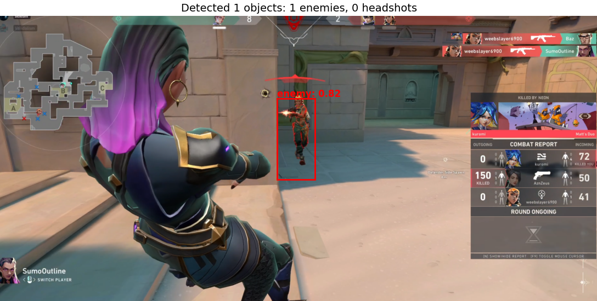
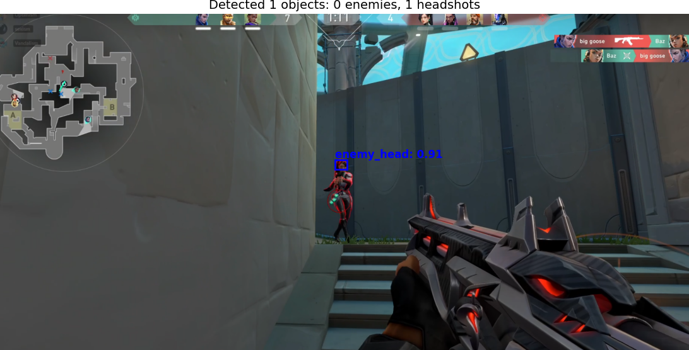
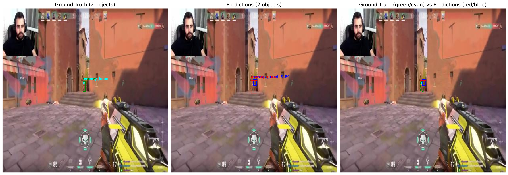
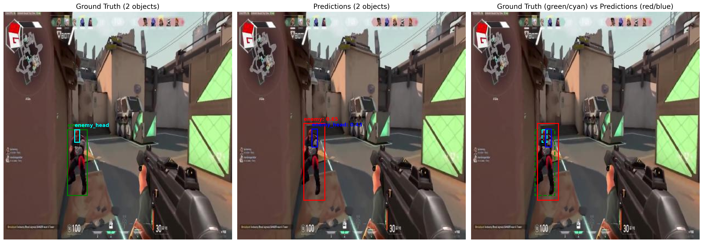

# Valorant Enemy Detection

Object detection models for Valorant using TensorFlow and a modified YOLO architecture with Feature Pyramid Networks (FPN).

Sample results on our own gameplay:



## Custom Model Description

This project implements a specialized enemy detection system that identifies enemy players and enemy heads in Valorant gameplay. Using a custom YOLO-style detection model built on MobileNetV2 backbone with FPN, the system can detect enemies with two classes:
- `enemy`: Full body detection
- `enemy_head`: Precise head detection for headshots

The model uses a 13x13 grid with 3 anchor boxes per cell, optimized for different enemy sizes and distances.

## Requirements

- Python 3.8+
- TensorFlow 2.x
- NumPy
- Matplotlib
- PIL (Pillow)
- OpenCV
- MSS (for screen capture)

## Installation

```bash
pip install tensorflow numpy matplotlib pillow opencv-python mss
```

## Model Architecture

- **Base Model**: MobileNetV2 (ImageNet pretrained)
- **Feature Pyramid Network (FPN)** for multi-scale detection
- **Detection Head**: Custom YOLO-style output (13x13 grid)
- **Input Size**: 416x416 pixels
- **Classes**: 2 (enemy, enemy_head)
- **Anchors**: 3 per grid cell, optimized for:
  - Small objects (heads)
  - Medium distance enemies
  - Close-range enemies

## Training Configuration

- **Batch Size**: 16
- **Epochs**: 100
- **Learning Rate**: 1e-4 with ReduceLROnPlateau
- **Data Augmentation**: Random brightness, contrast, and horizontal flips
- **Loss Function**: Custom YOLO loss with coordinate, objectness, and classification components

## Usage

To train the model:
```python
python model.py
```

The training script will:
- Load TFRecord datasets from `../tf_files/`
- Train with early stopping and model checkpointing
- Generate visualization outputs
- Save the final model to `trained_models/custom_detector/`

## Results
From Test data

